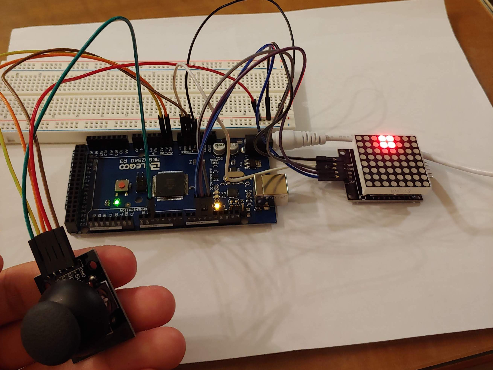

# LED Tetris
Programmed with C/C++ for Arduino Mega 2560.

## What you need
* A microcontroller (I personally used a Mega 2560.)
* An analog joystick
* 8x8 LED grid (MAX7219)
* A few M-M & M-F wires & breadboard

Schematics coming soon...

## Functionality
~~Planned development until school starts again (around late January 2020).
Will finish before then, hopefully.~~

Finished way faster than expected. (Took around 50 hours total, in a single consecutive 7-day period.)

Full Tetris game! Other than a minor bug (listed below), everything works pretty nicely. 
Pins are configurable. Feel free to modify the code to your liking to let it run on your hardware. 
I dunno why I made the input device a joystick instead of something more conventional. 
But at least it's kinda cool and old-school vibey(?)

## Changelog
* December 27th, 2019
  * Finished project! (exception: one minor bug...)
  * Implemented pretty much every real function that tetris should have. Yesterday's work was mostly getting the framework down to implement these things easily.
    * This included rotate, place, place fast, game over, restart...
    * Pretty much all the transitions you see in the most recent FSM diagram
  * Planning some more modifications (like adding T-spin maybe)
* December 26th, 2019
  * Bare-bones structure in place.
  * FSM finalized with the transitions, as well as some hardcoded conditions/inputs
  * Tons of bugs but at least the joystick works somewhat...
  * Can shift block left or right, but the blocks go off-screen and never come back :(
* December 21st, 2019
  * Added pins for joystick and LED matrix.
  * Thought of a rough FSM sketch.

## Known bugs
* When rotating a block, the code does not rigorously check if the block in its newly rotated position does not coincide with any existing ground blocks. Consequently, some weird things can happen, like your block going through the ground. 
  * Similarly, shifting a block all the way left or right of the grid, then rotating it, sometimes rotates the entire block such that it lies outside the 8x8 grid (and thus you get a "truncated" block).
  * Somewhat hard to fix, so I'll keep thinking of an optimal way to fix it. For now, the bug remains. 

## Images
### Check out some images!

